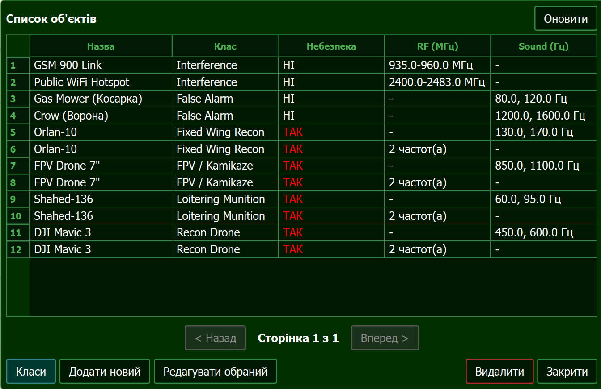
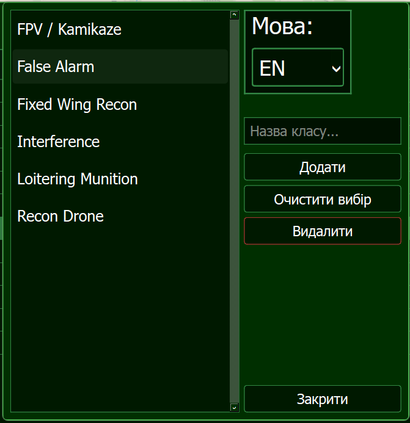
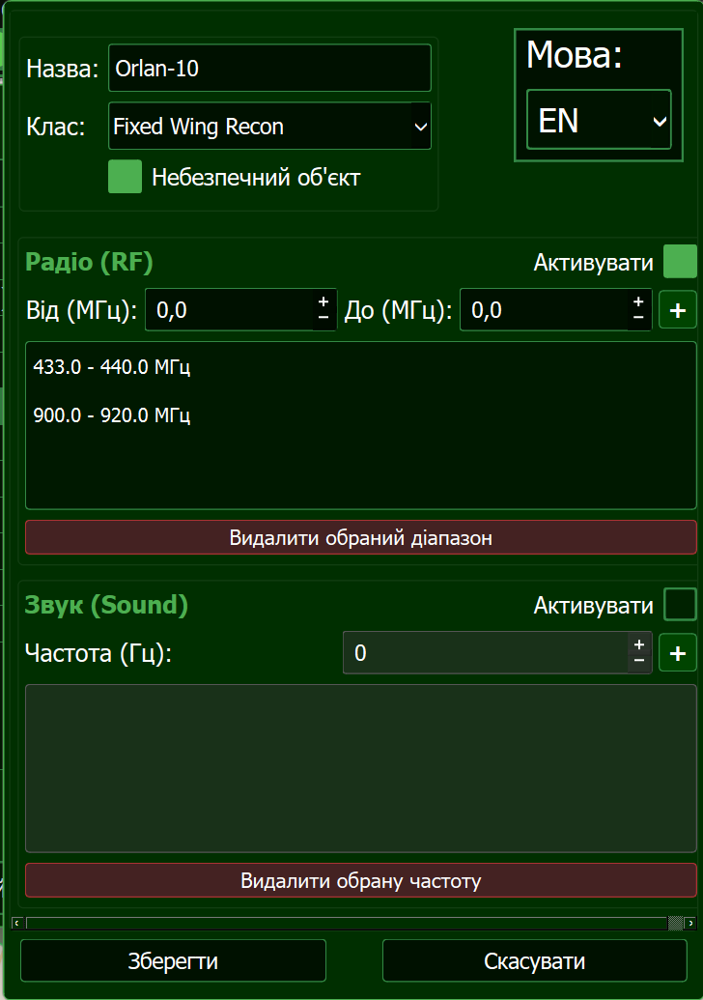
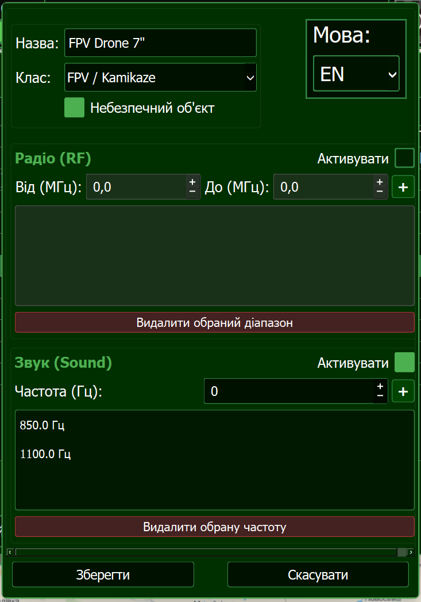

# Керування об'єктами детекції

Модуль Оператора дозволяє гнучко налаштовувати базу сигнатур (об'єктів), які система здатна розпізнавати. Кожен об'єкт має свою назву, належить до певного "Класу" (наприклад, FPV, Крило) та має свої унікальні частотні характеристики.

---

## 📂 Крок 1: Керування класами об'єктів

Перш ніж додати конкретний БПЛА, переконайтеся, що для нього існує відповідний клас (категорія).

1. Натисніть кнопку **"Об'єкти та Класи"** на головній панелі (іконка папки з файлами).
2. Відкриється вікно **"Менеджер об'єктів"**.

3. Натисніть кнопку **"Керування класами"**, щоб відкрити "Менеджер класів".

4. У цьому вікні ви можете:
   - **Додати:** ввести назву (наприклад, `FPV` або `DJI`) і натиснути "Додати".
   - **Редагувати:** обрати клас зі списку, змінити назву та натиснути "Зберегти".
   - **Видалити:** обрати клас і натиснути "Видалити".

---

## 🛠 Крок 2: Додавання нового об'єкта

Коли необхідні класи створені, можна додавати самі об'єкти (сигнатури).

1. У **Менеджері об'єктів** натисніть кнопку **"Додати об'єкт"**.
2. Відкриється вікно **"Редактор об'єкта"**. Заповніть наступні поля:
   - **Назва:** Конкретна модель або назва сигнатури (наприклад, `Mavic 3 Video`).
   - **Клас:** Оберіть зі списку раніше створених класів.
   - **Небезпечний:** Встановіть прапорець, якщо цей об'єкт становить високу загрозу (впливає на візуалізацію та автоматичну активацію реле).

### Встановлення параметрів сигналу

Сигнатура може базуватися **або** на радіочастотах (RF), **або** на звукових частотах (Sound). Ці два типи є взаємовиключними.

- **RF (Радіочастоти):**
  Увімкніть відповідний прапорець. Введіть `Мін. частоту (МГц)` та `Макс. частоту (МГц)` (якщо це одна частота — введіть однакові значення) і натисніть "+". Ви можете додати кілька діапазонів для одного об'єкта.
- **Sound (Звук):**
  Увімкніть прапорець звуку. Введіть частоту (у Герцах) та натисніть "+". Можна додати кілька звукових гармонік.

!!! tip "Захист від помилок"
Система автоматично перевіряє введені діапазони і не дозволить додати частоти, що перетинаються або повністю дублюють вже існуючі для цього об'єкта.

---

## 💾 Крок 3: Збереження та синхронізація

Після заповнення всіх полів натисніть **"Зберегти"**.

- Дані миттєво відправляються по TCP до Обчислювального модуля (Raspberry Pi).
- Сервер зберігає їх у свою SQLite базу даних.
- Аналізатор (DSP) одразу починає використовувати нові параметри для пошуку цілей в ефірі.

Усі об'єкти в Менеджері відображаються у вигляді зручної таблиці з підтримкою пагінації, де ви можете будь-якої миті змінити (подвійний клік по рядку) або видалити їх.
