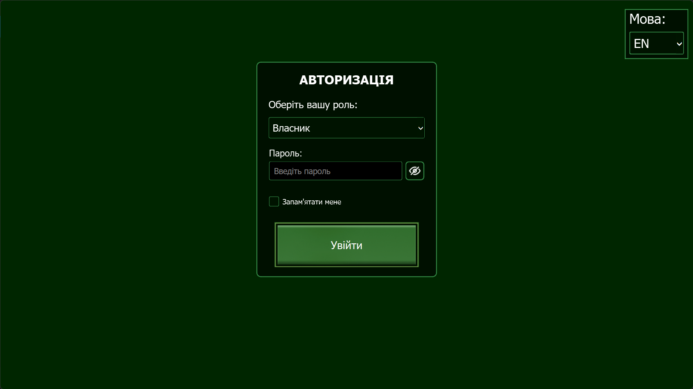

# Безпека та Авторизація

Модуль Оператора має вбудовану систему розмежування прав доступу та механізми захисту конфігурації.

---

## 👥 Ролі користувачів

У системі передбачено дві основні ролі:

1.  **Оператор:** Має доступ до моніторингу в реальному часі, перегляду логів та керування реле (Jammer). Вхід під цією роллю не потребує пароля.
2.  **Власник (Owner):** Має повний доступ до всіх функцій, включаючи зміну системних налаштувань, керування базою сигнатур та зміну пароля.

---

## 🔑 Вхід у систему

1.  При запуску програми відкриється вікно авторизації.

2.  Оберіть свою роль у випадаючому списку.
3.  Якщо обрано роль "Власник", введіть пароль.
    - Ви можете натиснути іконку "око", щоб перевірити правильність вводу.
    - Опція **"Запам'ятати мене"** дозволить не вводити пароль при наступних запусках.

---

## 🔄 Зміна пароля

Змінити пароль Власника можна наступним способом:

### Скидання за допомогою фізичного ключа (USB)

Якщо ви забули пароль, у системі реалізовано механізм апаратного скидання:

1.  Перебуваючи на екрані авторизації, вставте в пристрій (ПК або Raspberry Pi) спеціально підготовлений **USB-ключ безпеки**.
2.  Система автоматично розпізнає ключ і миттєво відкриє вікно зміни пароля, ігноруючи старий.
3.  Після встановлення нового пароля витягніть USB-ключ.

!!! info "Вимоги до пароля"
Новий пароль повинен бути надійним: містити не менше 6 символів, усі символи мають бути дозволеними, в інщому випадку біль пол з'явиться повідомлення про помилку валідації. Валідність пароля перевіряється автоматично.

---

## 🛡️ Вихід з акаунту (Logout)

Для зміни користувача або завершення безпечної сесії:

1.  Відкрийте **"Меню"**.
2.  Натисніть червону кнопку **"Вийти з акаунту"**.
3.  Додаток перезавантажиться і знову покаже вікно авторизації.
