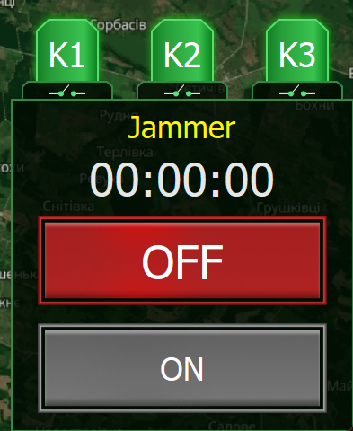

# Керування апаратною частиною (Реле / GPS)

Модуль Оператора дозволяє дистанційно керувати периферійним обладнанням, яке підключене до Обчислювального модуля (Raspberry Pi), зокрема апаратними реле (Jammer, Сирена тощо) та зчитувати дані з датчиків.

---

## 📡 Моніторинг GPS

Система автоматично зчитує координати з GPS-модуля (якщо він підключений до Сервера).

- **Візуалізація:** Ваша поточна позиція відображається на головній мапі як центр радару.
- **Синхронізація:** Координати оновлюються з інтервалом, який вказано у налаштуваннях (за замовчуванням — 1 раз на 2 хвилини або частіше).
- **Використання:** При виявленні БПЛА система автоматично розраховує азимут та відстань цілі відносно ваших поточних GPS-координат.

---

## 🛡 Керування апаратними реле (Jammer, Сирена)

Сервер на Raspberry Pi може мати підключені апаратні реле (K1, K2, K3 тощо). Модуль Оператора використовує ці реле для активації засобів протидії (Jammer), систем сповіщення (сирена) або іншого обладнання.

### 1. Налаштування (Які реле використовувати?)

Перед початком роботи ви можете вказати, які саме фізичні реле будуть активовані при виявленні загрози.

1. Натисніть кнопку **"Меню"** (Налаштування) на головній панелі.
2. У вікні знайдіть поле **"Набір реле:"**.
3. Оберіть зі списку необхідну комбінацію контактів, до яких підключено ваше обладнання (наприклад, `K1, K2`).

### 2. Ручне керування

1. На головному екрані знайдіть панель "Jammer".

2. Натисніть кнопку **"ON"**. Додаток відправить TCP-команду на Сервер для замикання обраних реле, а таймер почне відлік часу роботи.
   Індикатори обраних реле (K1, K2...) на екрані змінять колір на червоний.
3. Для вимкнення натисніть кнопку **"OFF"**.

### 3. Автоматичне керування

Для безпеки та швидкості реакції доступні два режими автоматизації (налаштовуються у **"Меню"**):

- **Авто-старт реле:** При виявленні об'єкта, який ви позначили в системі як "Небезпечний" (Dangerous), Модуль Оператора автоматично надішле команду на активацію обраних реле без вашого втручання. (Встановіть галочку "Активувати").
- **Авто-стоп реле:** Щоб уникнути перегріву підключеного обладнання, ви можете задати **"Інтервал стопу (с)"**. Коли таймер роботи реле досягне цього значення, вони вимкнуться автоматично.

!!! warning "Безпека"
Уважно налаштовуйте таймери Auto-Stop для запобігання пошкодження обладнання через перегрів. Якщо до реле підключено Jammer (глушилку), пам'ятайте, що його робота може впливати на дружні засоби зв'язку.
