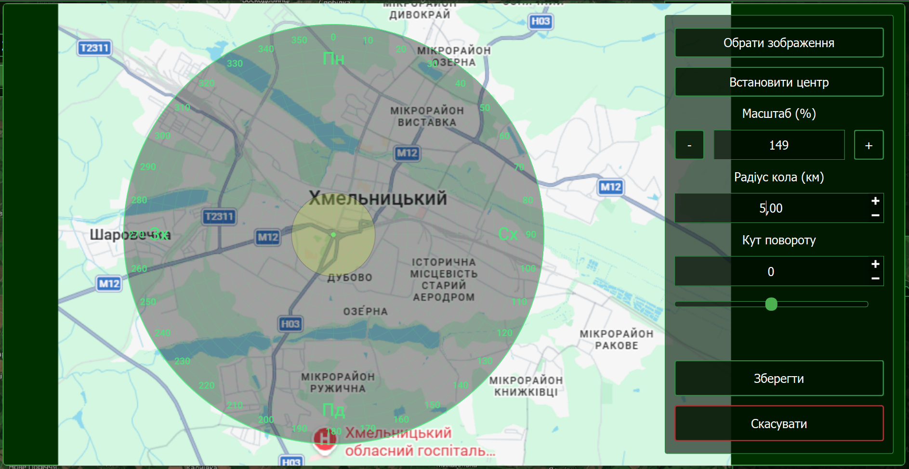

# Налаштування власної мапи

Модуль Оператора дозволяє використовувати будь-яке зображення як підкладку для радара. Це корисно для роботи в локаціях, де відсутній інтернет або потрібні детальні аерофотознімки конкретної місцевості.

---

## 🗺️ Крок 1: Відкриття вікна налаштування

1.  Натисніть кнопку **"Встановити карту"** (іконка карти) на головній панелі (ліва частина екрану).
2.  Відкриється вікно **"Налаштування власної карти"**.

---

## 🖼️ Крок 2: Завантаження та підготовка зображення

У панелі керування (праворуч) виконайте наступні дії:

1.  **Обрати зображення:** Натисніть кнопку та виберіть файл формату PNG, JPG або BMP зі свого пристрою.
2.  **Масштабування:** Використовуйте кнопки `+` / `-` або поле **"Масштаб (%)"**, щоб підігнати розмір зображення під робочу область.
3.  **Кут повороту:** Якщо мапа не орієнтована на північ, скористайтеся слайдером або полем вводу для її обертання.

---

## 🎯 Крок 3: Прив'язка координат (Калібрування)

Це найважливіший етап, що забезпечує точність відображення БПЛА на екрані.

1.  **Встановити центр:** Натисніть цю кнопку. Курсор зміниться.
2.  **Вибір точки:** Клікніть на мапі в тому місці, де ви фізично знаходитесь (ваші GPS координати). Це місце стане центром кола радара.
3.  **Встановлення масштабу:** У полі **"Радіус кола (км)"** вкажіть, яку реальну відстань у кілометрах покриває червоне коло на вашому зображенні.

!!! info "Як це працює?"
    Система автоматично розраховує кількість пікселів на кілометр. Наприклад, якщо ви вказали радіус 5 км, то всі об'єкти, виявлені сервером, будуть відображені на мапі з математичною точністю відносно встановленого центру.

---

## 💾 Крок 4: Збереження

Натисніть кнопку **"Зберегти"**. Модуль Оператора сформує фінальне зображення з урахуванням ваших правок і встановить його як основний фон радара. Тепер ви будете бачити цілі на реальній підкладці вашої місцевості.
