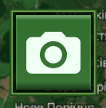
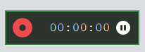
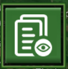

# Запис екрану та Скріншоти

Модуль Оператора дозволяє фіксувати події на екрані для подальшого створення звітів. Усі збережені медіафайли автоматично поміщаються у директорію `media/` у корені проекту.

---

## 📸 Створення скріншоту

Якщо ви помітили підозрілий сигнал на спектрограмі або хочете зафіксувати координати цілі, ви можете миттєво зберегти знімок екрану.

1.  На головній панелі інструментів (зліва зверху) натисніть кнопку **"Зробити скріншот"** (іконка фотоапарату).

2.  Додаток захопить весь інтерфейс програми (без системних панелей Windows/Linux).
3.  Знімок буде збережено у форматі PNG з іменем `screenshot_YYYY-MM-DD_hh-mm-ss.png`.

---

## 🎥 Запис екрану (Відео)

Для фіксації динаміки переміщення об'єктів або поведінки радіосигналу використовуйте вбудовану функцію відеозапису. Запис виконується у фоновому потоці (`RecordingService`), тому він не уповільнює роботу радарів якщо системних ресурсів достатньо.

### Початок запису

1.  Натисніть кнопку **"Запис екрану"** (іконка з камерою). Після чого з'явиться меню запису екрану, та запис розпочнеться.
2.  Кнопка змінить колір на червоний, а поруч з'явиться **панель статусу запису**.
3.  На панелі статусу ви побачите індикатор запису та таймер тривалості.

Відео зберігається з частотою 15 кадрів/с у форматі `.mp4`.

### Пауза та Зупинка

- **Пауза:** Ви можете тимчасово призупинити запис, натиснувши кнопку "Пауза" на панелі статусу. Натисніть її ще раз, щоб продовжити.
- **Зупинка:** Щоб завершити збереження файлу, натисніть кнопку "Запис екрану" ще раз. Панель статусу зникне, а файл `record_YYYY-MM-DD_hh-mm-ss.mp4` буде збережено у папці `media/`.

!!! warning "Навантаження на систему"
    Відеозапис може підвищити використання процесора (CPU). Використовуйте цю функцію, коли система має достатній запас потужності.

---

## 📂 Перегляд та Відтворення (Files View)

Ви можете переглянути зняті медіафайли, не виходячи з програми.

1.  Натисніть кнопку **"Перегляд файлів"** (іконка папки на бічній панелі).

2.  Відкриється стандартне вікно вибору файлу, автоматично спрямоване у папку `media/`.
3.  Оберіть потрібний скріншот або відеозапис.
4.  **Вбудований плеєр:** Додаток спробує відтворити файл за допомогою внутрішнього сервісу. Якщо на системі встановлено VLC, ви зможете керувати відтворенням (пауза, перемотка) прямо в інтерфейсі. В іншому разі файл буде відкрито стандартним плеєром вашої ОС.

---

## 🧹 Керування пам'яттю

З часом відеофайли можуть займати багато місця на диску.
Щоб уникнути переповнення накопичувача:

1. Відкрийте **"Меню"** (Налаштування).
2. У розділі "Обслуговування" оберіть зі списку `Screenshots` або `Screen records`.
3. Увімкніть автоматичне очищення та вкажіть кількість днів для зберігання файлів.

