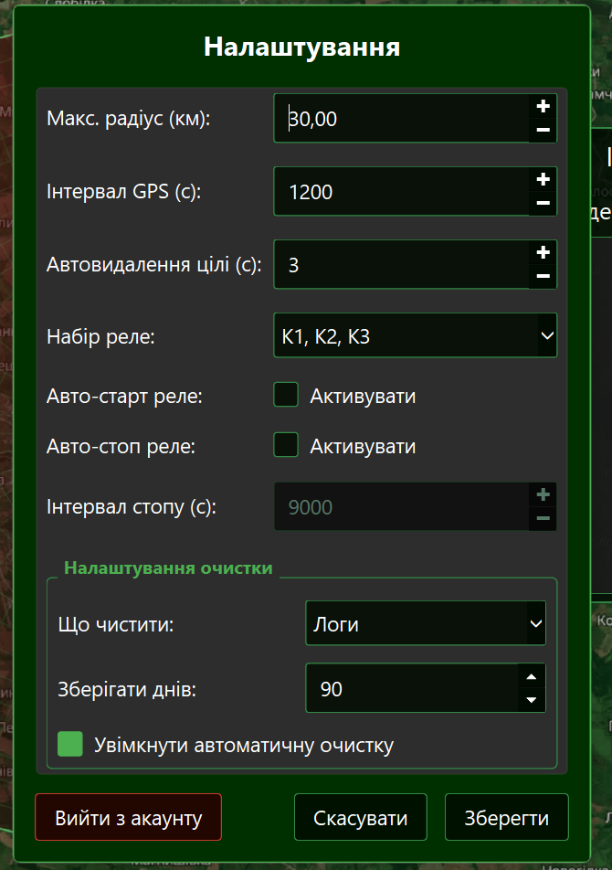

# Системне меню та Налаштування

Вікно **"Меню"** є центром конфігурації Модуля Оператора. Тут ви можете змінити параметри роботи радарів, налаштувати автоматизацію реле та керувати сховищем даних.

---

## ⚙️ Як відкрити меню

На головному екрані програми натисніть кнопку **"Меню"** (на панелі інструментів праворуч).

---

## 🛠 Опис параметрів конфігурації

Вікно містить перелік налаштувань, згрупованих за призначенням:

### 1. Параметри детекції та мапи

- **Макс. радіус (км):** Обмежує радіус радару для оператора, та завантажує карту відповідної якості. (якщо детекція буде знаходитися за межами радара, то вона відмалюється на контурі з жовтою позначкою)
- **Інтервал GPS (с):** Частота запиту нових координат від Сервера. Менший інтервал дає точнішу позицію при русі, але створює більше мережевого трафіку.
- **Автовидалення цілі (с):** Час (Time-to-Live), через який об'єкт зникне з екрану, якщо від нього перестали надходити нові сигнали.

### 2. Керування реле (Jammer)

- **Набір реле:** Оберіть комбінацію апаратних контактів Raspberry Pi, які будуть замикатися при натисканні кнопки "ON" на головному екрані.
- **Авто-старт реле:** Якщо прапорець "Активувати" встановлено — система сама активує реле при детекції небезпечного об'єкта.
- **Авто-стоп реле:** Дозволяє автоматично вимкнути реле через заданий **Інтервал стопу (с)**, щоб запобігти перегріву підключеного обладнання.

---

## 🧹 Група "Налаштування очистки"

Цей блок відповідає за автоматичне видалення застарілих даних:

1.  Оберіть категорію у полі **"Що чистити"** (Логи, Скріншоти або Відеозаписи).
2.  Встановіть галочку **"Увімкнути автоматичну очистку"**.
3.  Вкажіть кількість днів у полі **"Зберігати днів"**.

---

## 🚪 Керування сесією

У нижній частині вікна знаходиться кнопка **"Вийти з акаунту"**. Вона використовується для зміни користувача (наприклад, перехід від Оператора до Власника) або скидання пароля за допомогою USB-ключа.

!!! note "Збереження змін"
    Натисніть кнопку **"Зберегти"**, щоб нові параметри набрали сили. Якщо ви натиснете "Скасувати" або закриєте вікно — старі налаштування залишаться без змін.
