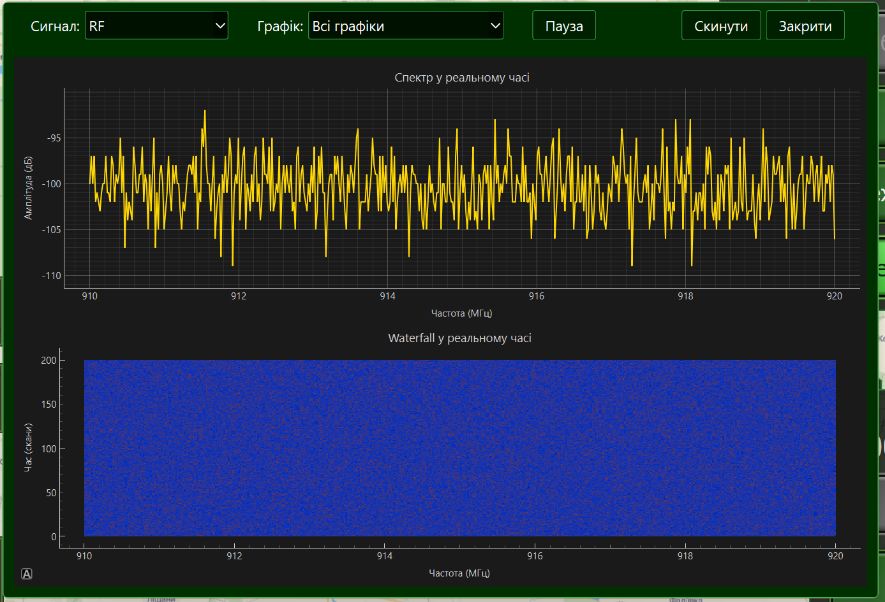
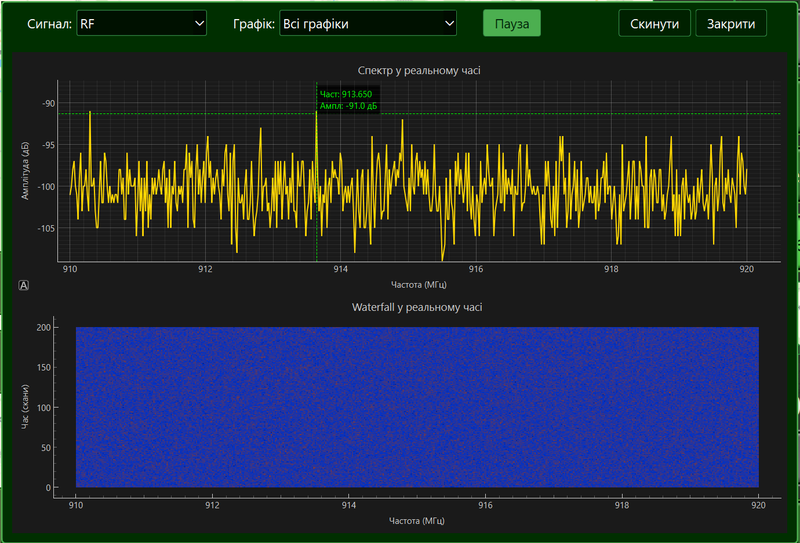

# Моніторинг потоку частот (Real-time)

Модуль Оператора дозволяє спостерігати за сирим радіоефіром або акустичним фоном у реальному часі. Це допомагає виявляти невідомі сигнали, які ще не внесені до бази сигнатур.

---

## 📈 Як відкрити моніторинг

1.  На панелі у верхній частині екрану натисніть кнопку **"Монітор"** (іконка графіка).
2.  Відкриється вікно **"Моніторинг сигналів у реальному часі"**.

---

## ⚙️ Налаштування відображення

У верхній панелі вікна доступні наступні елементи керування:

### 1. Вибір джерела (Сигнал)

Ви можете перемикатися між двома типами вхідних даних:

- **RF:** Радіочастотний спектр, що надходить від SDR-приймача.
- **Sound:** Акустичний спектр, що зчитується з мікрофонів сервера.

### 2. Режим графіка

Оберіть найбільш зручний спосіб візуалізації:

- **Всі графіки (Both):** Одночасне відображення спектрограми (зверху) та водоспаду (знизу).
- **Лише Спектр (Spectrum):** Графік миттєвої потужності сигналу (дБ) відносно частоти.
- **Лише Водоспад (Waterfall):** Хронологія змін спектру (час іде зверху вниз, інтенсивність кольору означає силу сигналу).

---

## 🛠 Керування переглядом

- **Пауза:** Натисніть кнопку "Пауза", щоб зупинити оновлення і детально вивчити конкретний сплеск на графіку. При активній паузі стає доступним перегляд значень при наведенні курсору.

- **Масштабування (Zoom):** Використовуйте коліщатко миші для наближення конкретної ділянки частот.
- **Скинути:** Кнопка **"Скинути"** повертає масштаб графіка до стандартних значень (весь діапазон).

!!! info "Важливо для продуктивності"
    Потік даних у реальному часі створює навантаження на мережу Ethernet. Закривайте вікно моніторингу, якщо ви його не використовуєте, щоб звільнити ресурси для основної детекції цілей.
